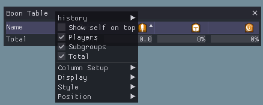

# [Click Here to Download](/../../releases)

# ArcDPS Boon Table

## Usage

Alt+Shift+B (overwrites Arc’s default boon table hotkey) or checkbox in the arc options

Right-click for options to change column visible and other settings.  
Table columns can be reordered by dragging the column header.  
Sort by column by clicking on the header, it is sorted by character name by default.

### options
- Players: Show/Hide all players in the table (Default: ON)
- Subgroups: Show/Hide subgroup average (Default: ON)
- Total: Show/Hide group/squad average (Default: ON)
- NPCs: Show/Hide boons of NPCs (Default: ON)
    - only available for 3 encounters (Deimos, Escort and River of souls)
- Column Setup: Show/Hide the columns of the table.
- Style: Styling option for this window
    - Show value as progress bar: Show the values as progressbar additional to the actual number. (Default: ON)
    - Alternating Row Background: Show/Hide background colors, to better distinguish rows. (Default: ON)
    - Show header with text instead of images: Change the header images back into normal text (Default: OFF)
    - Hide window header: Hider the header of the imgui window. The table header will still be there (Default: OFF)
    - Show only your subgroup: In the player section show only the players that are in your subgroup. (Default: OFF)
    - SHow only yourself: In the player section show only yourself (Default: OFF)
    - Coloring Mode: How to color the text/progress bars. Can be Default (Gray), By percentage (red to green) and By Profession. (Default: Default)
    - Alignment: Align the text to the column. Can be Left, Right, Center and Unaligned. Unaligned means, that it is most left as possible, without beeing on top of the progress bar. (Default: Right)
    - Sizing Policy: Change how the window is resized.
        - Autoresize window to content: This will automatically resize the window all the times, Name and Subgroup colomns can be resized by dragging.
        - Size content to window: Change the window size by dragging the bottom left/right corner. The columns will automatically resize to fit into the window.
        - Manual window resizing: Change the window size by dragging the bottom left/right corner. When the table is larger than the window allows, a scrollbar will be added.
    - Boon column width: Change the width of boon columns, all boon columns have the same width. Not available when "Size content to window" is active. (Default: 80)
    - Self Color: Change the color of yourself in the list. (Default: arcdps CCOL_YELLOW)

## Translations
Translations can be added by creating a file in `<Guild Wars 2>/addons/arcdps` called `arcdps_table_lang.ini`.
To create your own translation you can take the example file in [localization](/localization).

- [Chinese Translation by Snowy](https://github.com/Snowy1794/Arcdps-boon-table-translation-Chinese-simplified)

## LICENSE
This project is Licensed with the MIT License.

### Dear ImGui
[Dear ImGui](https://github.com/ocornut/imgui) is licensed with the MIT License and included as git submodule to this project.

### arcdps-extension
[arcdps-extension](https://github.com/knoxfighter/arcdps-extension) is licensed with the MIT License and included as git submodule to this project.

### modernIni
[modernIni](https://github.com/knoxfighter/modernIni) is licensed with the MIT License and included as git submodule to this project.

### Game Graphics
© 2021 NCSOFT Corporation. All rights reserved. NCSOFT, ArenaNet, the interlocking NC logo, Aion, Lineage II, Guild Wars, Guild Wars 2: Heart of Thorns, Guild Wars 2: Path of Fire, Blade & Soul, and all associated logos, designs, and composite marks are trademarks or registered trademarks of NCSOFT Corporation. All other trademarks are the property of their respective owners. 

## Changelog
    
    April 12 2021
        Added tracking of NPCs
            Desmina at River of Souls
            Saul D'Alessio at Deimos
            Glenna at Escort
        Added possibility to open up to 5 boon table windows
        localization (activate by creating a file called `arcdps_table_lang.ini`, english translation can be found in localization in this repo)
        added icons in the table header
        added option to hide window header
        added mutliple sizing policies
        added slider to change column width
        made by percentage color darker for better readability
        colors in text mode are brighter for readability
        added option to only show players in your subgroup
        added option to only show yourself as player
        maked yourself yellow
        header will respond to alignment setting
        Removed different contextmenus. It is now only one menu that allows to change everything about one window
    February 22 2021
        Add compatibility to new arcdps with ImGui 1.80.
        Change table to use modern ImGui table instead of old one.
            This gives the possibility to hide, reorder and sort columns in a more easy way.
    July 20 2019
        Add dynamic version string
        Make boon generation not cap at 100% for duration stacking boons
        Use arcdps exports instead of reading the arc ini manually
        Add tracking for Signet of inspiration (more coming soon)
        Remember boons on players bars when they exit combat instead of assuming they will expire before player reenters combat
            Fixes an accuracy bug mainly visible in FotM / WvW
        Significant performance improvements (30%-50% reduction in cpu usage to render the table)
        Misc code cleanup
    May 11 2019
        Remove Glyph of Empowerment tracking since it’s no longer in the game
        Add tracking for stealth and superspeed
    April 23 2019
        Fix a rare crash in cases of extreme boon generation
    February 1 2019
        Add initial boon generation support
            I’ve tested this a considerable amount myself, but please let me know of any oddities regarding generation. (Uptime is still as accurate as ever)
        Fix showing old subsquads when in a party
        Hide UI during loading screens/character select
    January 8 2019
        Fix crash when launching GW2 with the UI hidden
        Rework when the ‘Total’ row shows
    January 1 2019
        Completely rewrite the table’s UI code
            let me know of any issues and feedback
        Fix keyboard input requiring the mechanics log to also be running
        Fix subgroups not updating when a known player joins the 2nd time
        Fix non-bar display being off by 2 decimal places
        Change menus to mimic arcdps’s new style
    December 25 2018
        Add tracking for water spirit
        Add initial support for pre-booning (mainly impacts fractals)
        Code Cleanup
        Fix a bug where some boon applications would have vastly negative duration
    December 18 2018
        Add additional checks for empty player data
    December 13 2018
        Fix boon uptime calculation potentially overflowing in extended combat
        Add option to show uptime as a % instead of a progress bar
        Make options menu work anywhere on the window
        Make subgroup column only show if the subgroup section shows
        Add additional checks for empty player data
        Add support for boon extensions (requires new arcdps, not yet released)
    November 29 2018
        Add tracking for swiftness and resistance uptime
    November 7 2018
        Code cleanup
        Don’t show if a player currently has a boon as per Terms of Service (oops)
            Thanks to deltaconnected for pointing this out
    October 9 2018
        Simplify internal tracking code (breakage possible)
        Make a players initial subgroup accurate
    October 2 2018
        Update for arcdps cbtevent changes
    Sceptember 17 2018
        Fix some issues on player removes
    September 11 2018
        Fix potential crash when leaving a squad
        Fixed Total line showing after joining/leaving a squad
        Add optional “Y”/”N” for if a player has a boon currently
        Fix header column alignment
        Add rt-click button to clear the table as a temporary fix for arc’s missing remove notifies
        Update to match combat api changes
    August 18 2018
        Initial pre-release
