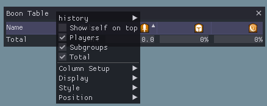

# [Click Here to Download](/../../releases)

# ArcDPS Boon Table

## Usage

Alt+Shift+B (overwrites Arc’s default boon table hotkey) or checkbox in the arc options

Right-click for options to change column visible and other settings.  
Table columns can be reordered by dragging the column header.  
Sort by column by clicking on the header, it is sorted by character name by default.

### options
- Players: Show/Hide all players in the table (Default: ON)
- Subgroups: Show/Hide subgroup average (Default: ON)
- Total: Show/Hide group/squad average (Default: ON)
- NPCs: Show/Hide boons of NPCs (Default: ON)
    - only available for 3 encounters (Deimos, Escort, and River of souls)
- Column Setup: Show/Hide the columns of the table.
- Style: Styling option for this window
    - Show value as progress bar: Show the values as progressbar additional to the actual number. (Default: ON)
    - Alternating Row Background: Show/Hide background colors, to better distinguish rows. (Default: ON)
    - Show header with text instead of images: Change the header images back into normal text (Default: OFF)
    - Hide window header: Hider the header of the imgui window. The table header will still be there (Default: OFF)
    - Show only your subgroup: In the player section show only the players that are in your subgroup. (Default: OFF)
    - SHow only yourself: In the player section show only yourself (Default: OFF)
    - Coloring Mode: How to color the text/progress bars. Can be Default (Gray), By percentage (red to green) and By Profession. (Default: Default)
    - Alignment: Align the text to the column. Can be Left, Right, Center, and Unaligned. Unaligned means, that it is most left as possible, without beeing on top of the progress bar. (Default: Right)
    - Sizing Policy: Change how the window is resized.
        - Autoresize window to content: This will automatically resize the window all the times, Name and Subgroup colomns can be resized by dragging.
        - Size content to window: Change the window size by dragging the bottom left/right corner. The columns will automatically resize to fit into the window.
        - Manual window resizing: Change the window size by dragging the bottom left/right corner. When the table is larger than the window allows, a scrollbar will be added.
    - Boon column width: Change the width of boon columns, all boon columns have the same width. Not available when "Size content to window" is active. (Default: 80)
    - Self Color: Change the color of yourself in the list. (Default: arcdps CCOL_YELLOW)

## Translations
The plugin is translated to English, French, German, Spanish, and simplified Chinese. French and Spanish Translations are only roughly, so please report any problems with them.

It is also possible to add translations with files. If you want to add a translation, create a file in the format `arcdps_table_lang_<langCode>.ini` and place it into `addons/arcdps/`.
The langCode is used as ID and also used in the save file to preserve the selected language.
In the settings, the translation key `LangageName` is used to display the name.
The english translation is available as a template `arcdps_table_lang_en.ini`.
Comments start with `;` and if translations are missing, it falls back to english.

## LICENSE
This project is Licensed with the MIT License.

### Dear ImGui
[Dear ImGui](https://github.com/ocornut/imgui) is licensed with the MIT License.

### Magic-Enum
[Magic-Enum](https://github.com/Neargye/magic_enum) is licensed with the MIT License.

### arcdps-extension
[arcdps-extension](https://github.com/knoxfighter/arcdps-extension) is licensed with the MIT License.

### arcdps-unofficial-extras
[arcdps-unofficial-extras](https://github.com/Krappa322/arcdps_unofficial_extras_releases) is licensed with the MIT License.

### modernIni
[modernIni](https://github.com/knoxfighter/modernIni) is licensed with the MIT License.

### Game Graphics
© 2021 NCSOFT Corporation. All rights reserved. NCSOFT, ArenaNet, the interlocking NC logo, Aion, Lineage II, Guild Wars, Guild Wars 2: Heart of Thorns, Guild Wars 2: Path of Fire, Blade & Soul, and all associated logos, designs, and composite marks are trademarks or registered trademarks of NCSOFT Corporation. All other trademarks are the property of their respective owners. 
